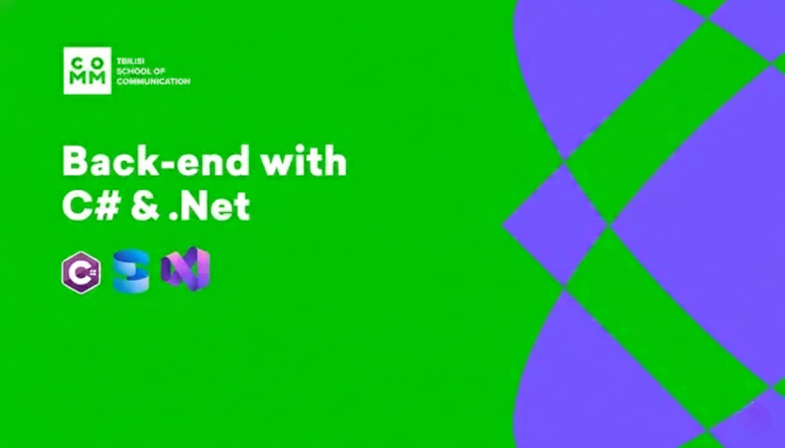

# HomeWorks Ecosystem

---

Welcome to the **HomeWorks** repository. This workspace serves as a centralized hub for academic assignments, technical exercises, and project documentation.

## 🚀 Project Overview

The goal of this repository is to track progress through various homework modules, ensuring high standards of documentation and code quality.

## 📂 Directory Structure

### [Homework 1](./Homework1)
*   **[Documentation](./Homework1/Homework1.txt)**: Final report for the first module.

### [Homework 2](./Homework2)
*   **[Solution](./Homework2/Homework2.slnx)**: Visual Studio Solution for the console application.
*   **[Console App Source](./Homework2/Homework2App/Program.cs)**: Main entry point for the C# console application.

### [Homework 3](./Homework3)
*   **[Solution](./Homework3/Homework3.slnx)**: Visual Studio Solution for the console application.
*   **[Console App Source](./Homework3/Homework3App/Program.cs)**: C# console application with 5 tasks.

### [Homework 4](./Homework4)
*   **[Solution](./Homework4/Homework4.slnx)**: Visual Studio Solution for the console application.
*   **[Console App Source](./Homework4/Homework4App/Program.cs)**: C# console application with 4 tasks: even/odd filter, contact manager, element counter, top N selector.
*   **[README](./Homework4/README.md)**: Documentation for Homework 4.

### [Homework 5](./Homework5)
*   **[Project](./Homework5/Homework5App/Homework5App.csproj)**: .NET 10 console application with 6 tasks.
*   **[Console App Source](./Homework5/Homework5App/Program.cs)**: Main entry point that orchestrates six modular task implementations.
*   **[README](./Homework5/README.md)**: Documentation for Homework 5.

---
*Built with precision and a commitment to continuous learning.*
